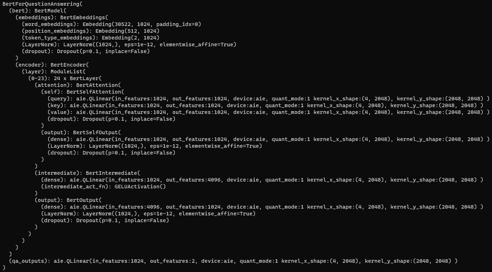

# BERT

This example shows **bert-large-uncased-whole-word-masking-finetuned-squad** with Linear operator quantized using Pytorch and deployed on AIE / Custom CPU backends.

The model is taken from [Huggingface](https://huggingface.co/bert-large-uncased-whole-word-masking-finetuned-squad)

To see all supported modes and help
```
bash$> python run.py --help
```


To run the model out of the box, with CPU target
```
# Default FP32
bash$> python run.py --target cpu --precision fp

# Load FP32 Model -> Perform dynamic quantization -> execute on CPU
bash$> python run.py --target cpu --precision int
```

To run the model on AIE backend run the following command.
This command loads FP32 Model, performs PyTorch Dynamic Quantization, transform's the model by replacing linear nodes with custom linear nodes with AIE backend and performs inference.
```
bash$> python run.py --target aie --precision int
```

To run the model on Custom CPU backend run the following command.
This command loads FP32 Model, performs PyTorch Dynamic Quantization, transform's the model by replacing linear nodes with custom linear nodes with CPU backend and performs inference.
```
bash$> python run.py --target customcpu --precision fp
bash$> python run.py --target customcpu --precision int
```

## Model Structure
This image shows model structure after quantizing and replacing Linear node with AIE custom linear node.


## Example outputs from AIE

The performance is not tuned for this model.

```

Question:
What chapter is this?

Answer:
Chapter xi borrow ##de ##an shows his " hand ".
0 Inference time: 7.7797245s
********************
I am unable to find the answer to this question. Can you please ask another question?

Question:
Where did this occur?

Answer:
None
1 Inference time: 5.5455611000000005s
********************

Question:
While doing what?

Answer:
Mag ##nes ##on took a walk.
2 Inference time: 4.3517827s
********************

Question:
What did they see next?

Answer:
After asking his parents if it was ok , mark went to his grand ##dad ##dy ' s house . when he got there , they turned off the television and lamp and went around to the backyard . in his grand ##dad ##dy ' s backyard , there was a river and lots of plants and flowers.
3 Inference time: 3.5504408s
********************

Question:
And when would he get home?

Answer:
Midnight.
4 Inference time: 7.0794272000000005s
```
