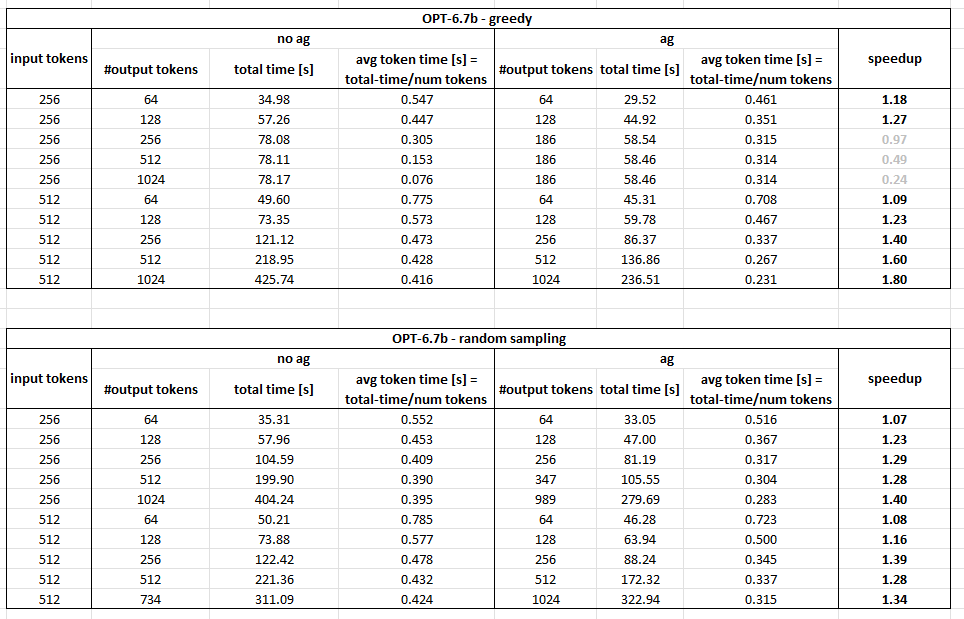

# Assisted generation

Assisted generation is similar to speculative decoding, released by [HuggingFace](https://huggingface.co/blog/assisted-generation).
This example shows how to run assisted generation with OPT (Open Pre-trained Transformer) class of language models.


# PHX

## 


## Greedy sampling


```python assisted_generation.py --model_name opt-6.7b --task benchmark ```
|   Example# |   Prompt Length (tokens) |   New Tokens Generated |   Total Time (s) |   Prefill Phase (ms) |   Time/Token (ms) |   Tokens/Sec |
|------------|--------------------------|------------------------|------------------|----------------------|-------------------|--------------|
|          1 |                      256 |                     64 |          34.9831 |              13134.9 |           345.834 |      2.89156 |
|          2 |                      256 |                    128 |          57.2613 |              12917.4 |           348.252 |      2.87148 |
|          3 |                      256 |                    186 |          78.0833 |              12890.4 |           351.518 |      2.84481 |
|          4 |                      256 |                    186 |          78.1126 |              12901.3 |           351.625 |      2.84394 |
|          5 |                      256 |                    186 |          78.1698 |              12921.8 |           351.824 |      2.84233 |
|          6 |                      512 |                     64 |          49.6045 |              26922.3 |           358.944 |      2.78595 |
|          7 |                      512 |                    128 |          73.3481 |              26847.8 |           365.1   |      2.73898 |
|          8 |                      512 |                    256 |         121.119  |              26835   |           368.69  |      2.7123  |
|          9 |                      512 |                    512 |         218.95   |              26840.8 |           374.876 |      2.66755 |
|         10 |                      512 |                   1024 |         425.742  |              26912.2 |           388.805 |      2.57198 |

```python assisted_generation.py --model_name opt-6.7b --task benchmark --assisted_generation```
|   Example# |   Prompt Length (tokens) |   New Tokens Generated |   Total Time (s) |   Prefill Phase (ms) |   Time/Token (ms) |   Tokens/Sec |
|------------|--------------------------|------------------------|------------------|----------------------|-------------------|--------------|
|          1 |                      256 |                     64 |          29.5194 |              13688.5 |           216.491 |      4.61914 |
|          2 |                      256 |                    128 |          44.9212 |              13526.8 |           216.73  |      4.61404 |
|          3 |                      256 |                    186 |          58.5378 |              13626.6 |           211.165 |      4.73564 |
|          4 |                      256 |                    186 |          58.4602 |              13594.2 |           210.973 |      4.73994 |
|          5 |                      256 |                    186 |          58.4597 |              13558.9 |           211.048 |      4.73826 |
|          6 |                      512 |                     64 |          45.3129 |              27913.3 |           243.807 |      4.1016  |
|          7 |                      512 |                    128 |          59.783  |              27939.2 |           221.213 |      4.52052 |
|          8 |                      512 |                    256 |          86.3702 |              27884.3 |           202.092 |      4.94824 |
|          9 |                      512 |                    512 |         136.861  |              27977.8 |           185.67  |      5.38589 |
|         10 |                      512 |                   1024 |         236.51   |              27839   |           177.734 |      5.62639 |

```python assisted_generation.py --model_name opt-6.7b --task benchmark --assisted_generation --draft_precision w8af32```
|   Example# |   Prompt Length (tokens) |   New Tokens Generated |   Total Time (s) |   Prefill Phase (ms) |   Time/Token (ms) |   Tokens/Sec |
|------------|--------------------------|------------------------|------------------|----------------------|-------------------|--------------|
|          1 |                      256 |                     64 |          29.9273 |              155.829 |           470.323 |      2.1262  |
|          2 |                      256 |                    128 |          42.7124 |              144.272 |           333.321 |      3.00011 |
|          3 |                      256 |                    256 |          70.9496 |              144.412 |           275.954 |      3.62379 |
|          4 |                      256 |                    512 |          98.2663 |              143.03  |           190.706 |      5.24367 |
|          5 |                      256 |                   1024 |         149.896  |              141.762 |           145.244 |      6.88498 |
|          6 |                      512 |                     64 |          46.0828 |              374.034 |           723.372 |      1.38241 |
|          7 |                      512 |                    128 |          60.9233 |              373.522 |           474.723 |      2.10649 |
|          8 |                      512 |                    256 |          91.1636 |              371.719 |           354.251 |      2.82286 |
|          9 |                      512 |                    512 |         142.918  |              376.803 |           277.437 |      3.60442 |
|         10 |                      512 |                   1024 |         271.592  |              374.419 |           263.378 |      3.79682 |


## Random sampling - temp: 1.0


```python assisted_generation.py --model_name opt-6.7b --task benchmark --do_sample --temperature 1.0```
|   Example# |   Prompt Length (tokens) |   New Tokens Generated |   Total Time (s) |   Prefill Phase (ms) |   Time/Token (ms) |   Tokens/Sec |
|------------|--------------------------|------------------------|------------------|----------------------|-------------------|--------------|
|          1 |                      256 |                     64 |          35.3142 |              13147.9 |           349.234 |      2.86341 |
|          2 |                      256 |                    128 |          57.9573 |              12930   |           352.16  |      2.83962 |
|          3 |                      256 |                    256 |         104.594  |              12926.4 |           357.089 |      2.80043 |
|          4 |                      256 |                    512 |         199.901  |              12957.8 |           363.393 |      2.75184 |
|          5 |                      256 |                   1024 |         404.236  |              12939.2 |           380.005 |      2.63155 |
|          6 |                      512 |                     64 |          50.2084 |              26972   |           366.222 |      2.73058 |
|          7 |                      512 |                    128 |          73.88   |              26926.6 |           367.164 |      2.72357 |
|          8 |                      512 |                    256 |         122.419  |              26922.9 |           371.948 |      2.68855 |
|          9 |                      512 |                    512 |         221.362  |              26915.5 |           377.934 |      2.64597 |
|         10 |                      512 |                    734 |         311.087  |              26910.4 |           385.197 |      2.59608 |

```python assisted_generation.py --model_name opt-6.7b --task benchmark --do_sample --temperature 1.0 --assisted_generation ```
|   Example# |   Prompt Length (tokens) |   New Tokens Generated |   Total Time (s) |   Prefill Phase (ms) |   Time/Token (ms) |   Tokens/Sec |
|------------|--------------------------|------------------------|------------------|----------------------|-------------------|--------------|
|          1 |                      256 |                     64 |          33.0489 |              13662.1 |           272.734 |      3.66657 |
|          2 |                      256 |                    128 |          47.002  |              13638.7 |           231.317 |      4.32307 |
|          3 |                      256 |                    256 |          81.19   |              13593.8 |           232.89  |      4.29388 |
|          4 |                      256 |                    347 |         105.548  |              13680.3 |           232.024 |      4.3099  |
|          5 |                      256 |                    989 |         279.693  |              13623.1 |           233.638 |      4.28012 |
|          6 |                      512 |                     64 |          46.2849 |              27786.6 |           249.793 |      4.00332 |
|          7 |                      512 |                    128 |          63.9411 |              27811.6 |           250.772 |      3.98769 |
|          8 |                      512 |                    256 |          88.2388 |              27859.4 |           204.424 |      4.89179 |
|          9 |                      512 |                    512 |         172.328  |              27678.2 |           247.036 |      4.048   |
|         10 |                      512 |                   1024 |         322.94   |              27305.5 |           249.26  |      4.01187 |
