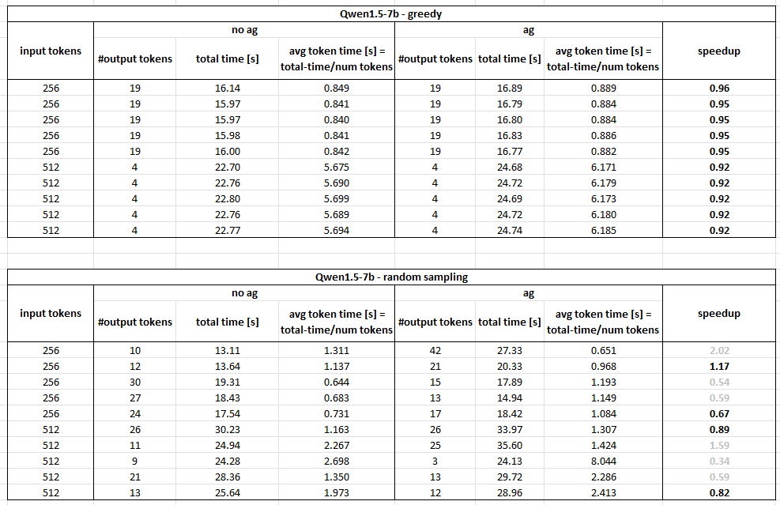

# Assisted Generation - Qwen1.5-7B-Chat

# No speed up observed for Qwen2

# PHX

## 


##  Greedy sampling


```python assisted_generation.py --model_name Qwen1.5-7B-Chat --task benchmark```

|   Example# |   Prompt Length (tokens) |   New Tokens Generated |   Total Time (s) |   Prefill Phase (ms) |   Time/Token (ms) |   Tokens/Sec |
|------------|--------------------------|------------------------|------------------|----------------------|-------------------|--------------|
|          1 |                      256 |                     19 |          16.1392 |              10378.1 |           317.163 |      3.15295 |
|          2 |                      256 |                     19 |          15.9739 |              10230.2 |           317.297 |      3.15163 |
|          3 |                      256 |                     19 |          15.9684 |              10240.2 |           316.441 |      3.16015 |
|          4 |                      256 |                     19 |          15.9787 |              10238.1 |           317.116 |      3.15342 |
|          5 |                      256 |                     19 |          15.9998 |              10240.1 |           318.186 |      3.14282 |
|          6 |                      512 |                      4 |          22.6996 |              21616.4 |           353.218 |      2.83111 |
|          7 |                      512 |                      4 |          22.7612 |              21684.3 |           350.339 |      2.85438 |
|          8 |                      512 |                      4 |          22.7954 |              21720.2 |           349.704 |      2.85956 |
|          9 |                      512 |                      4 |          22.7561 |              21672.2 |           352.588 |      2.83617 |
|         10 |                      512 |                      4 |          22.7741 |              21685.6 |           352.997 |      2.83288 |

## Assisted Generation : Draft 500m on CPU: bf16
```python assisted_generation.py --model_name Qwen1.5-7B-Chat --task benchmark --assisted_generation```

|   Example# |   Prompt Length (tokens) |   New Tokens Generated |   Total Time (s) |   Prefill Phase (ms) |   Time/Token (ms) |   Tokens/Sec |
|------------|--------------------------|------------------------|------------------|----------------------|-------------------|--------------|
|          1 |                      256 |                     19 |          16.8921 |              10599.5 |           230.83  |      4.33219 |
|          2 |                      256 |                     19 |          16.7918 |              10521.5 |           230.619 |      4.33615 |
|          3 |                      256 |                     19 |          16.7994 |              10558.2 |           229.641 |      4.35463 |
|          4 |                      256 |                     19 |          16.8257 |              10550.9 |           231.197 |      4.32532 |
|          5 |                      256 |                     19 |          16.7661 |              10551   |           230.701 |      4.33461 |
|          6 |                      512 |                      4 |          24.6847 |              21862.2 |           330.214 |      3.02834 |
|          7 |                      512 |                      4 |          24.7153 |              21895.6 |           327.263 |      3.05565 |
|          8 |                      512 |                      4 |          24.6907 |              21859.6 |           333.428 |      2.99915 |
|          9 |                      512 |                      4 |          24.7193 |              21885.7 |           329.666 |      3.03338 |
|         10 |                      512 |                      4 |          24.7417 |              21890.2 |           332.534 |      3.00721 |


##  Random sampling


```python assisted_generation.py --model_name Qwen1.5-7B-Chat --task benchmark --do_sample --temperature 1.0```
|   Example# |   Prompt Length (tokens) |   New Tokens Generated |   Total Time (s) |   Prefill Phase (ms) |   Time/Token (ms) |   Tokens/Sec |
|------------|--------------------------|------------------------|------------------|----------------------|-------------------|--------------|
|          1 |                      256 |                     10 |          13.1142 |              10264.5 |           307.816 |      3.24869 |
|          2 |                      256 |                     12 |          13.6392 |              10167.8 |           307.66  |      3.25034 |
|          3 |                      256 |                     30 |          19.3104 |              10192.9 |           307.102 |      3.25625 |
|          4 |                      256 |                     27 |          18.4311 |              10188   |           309.165 |      3.23452 |
|          5 |                      256 |                     24 |          17.5408 |              10251.8 |           309.253 |      3.23359 |
|          6 |                      512 |                     26 |          30.2343 |              21762.7 |           330.272 |      3.0278  |
|          7 |                      512 |                     11 |          24.9357 |              21514.2 |           332.358 |      3.00881 |
|          8 |                      512 |                      9 |          24.2834 |              21550.4 |           330.568 |      3.0251  |
|          9 |                      512 |                     21 |          28.3582 |              21553.7 |           331.458 |      3.01698 |
|         10 |                      512 |                     13 |          25.6441 |              21544   |           331.906 |      3.0129  |

## Assisted Generation : Draft 500m on CPU: bf16
```python assisted_generation.py --model_name Qwen1.5-7B-Chat --task benchmark --do_sample --temperature 1.0 --assisted_generation```
|   Example# |   Prompt Length (tokens) |   New Tokens Generated |   Total Time (s) |   Prefill Phase (ms) |   Time/Token (ms) |   Tokens/Sec |
|------------|--------------------------|------------------------|------------------|----------------------|-------------------|--------------|
|          1 |                      256 |                     42 |          27.3295 |              10763.4 |           267.131 |      3.74348 |
|          2 |                      256 |                     21 |          20.3339 |              10709.6 |           337.464 |      2.96328 |
|          3 |                      256 |                     15 |          17.8912 |              10654   |           340.406 |      2.93766 |
|          4 |                      256 |                     13 |          14.9364 |              10629.9 |           204.594 |      4.88774 |
|          5 |                      256 |                     17 |          18.4218 |              10600.8 |           326.391 |      3.06381 |
|          6 |                      512 |                     26 |          33.9696 |              22345.4 |           291.567 |      3.42974 |
|          7 |                      512 |                     25 |          35.5957 |              22058.6 |           361.042 |      2.76976 |
|          8 |                      512 |                      3 |          24.1319 |              21927.4 |           256.53  |      3.89817 |
|          9 |                      512 |                     13 |          29.7176 |              21928.3 |           331.913 |      3.01284 |
|         10 |                      512 |                     12 |          28.9613 |              21901.6 |           318.372 |      3.14098 |
