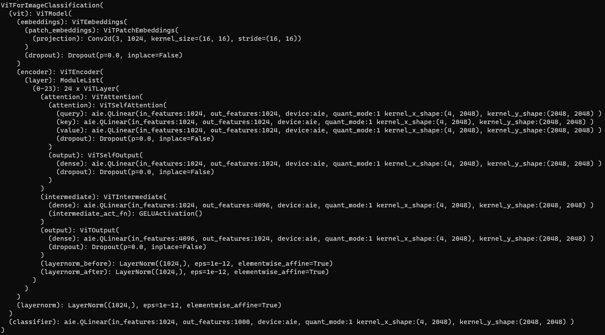

# Vision Transformer

This example shows **vit-large-patch16-224** with Linear operator quantized using Pytorch and deployed on AIE / Custom CPU backends.

The model is taken from [Huggingface](https://huggingface.co/google/vit-large-patch16-224)

To see all supported modes and help
```
bash$> python run.py --help
```

To run the model out of the box, with CPU target
```
# Default FP32
bash$> python run.py --modelsize large --target cpu --precision fp
bash$> python run.py --modelsize base --target cpu --precision fp

# Load FP32 Model -> Perform dynamic quantization -> execute on CPU
bash$> python run.py --target cpu --precision int
```

To run the model on AIE backend run the following command.
This command loads FP32 Model, performs PyTorch Dynamic Quantization, transform's the model by replacing linear nodes with custom linear nodes with AIE backend and performs inference.
```
bash$> python run.py --target aie --precision int
```

To run the model on Custom CPU backend run the following command.
This command loads FP32 Model, performs PyTorch Dynamic Quantization, transform's the model by replacing linear nodes with custom linear nodes with CPU backend and performs inference.
```
bash$> python run.py --target customcpu --precision fp
bash$> python run.py --target customcpu --precision int
```

## Model Structure
This image shows model structure after quantizing and replacing Linear node with AIE custom linear node.


```
Layers in model: {'total': 148, 'Conv2d': 1, 'Dropout': 37, 'QLinearExperimentalCPU': 73, 'GELUActivation': 12, 'LayerNorm': 25}
```
